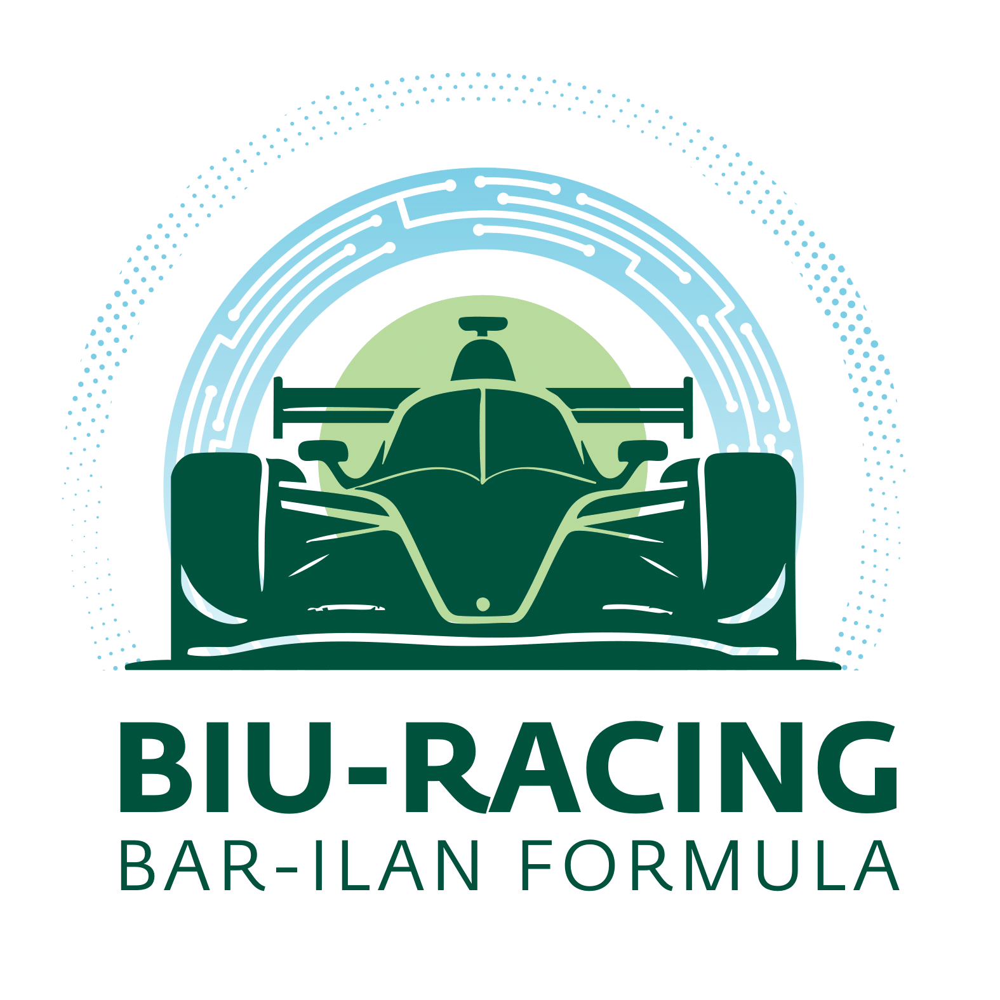

<div align="center">
  

  # BIU Racing - Official Team Website 🏎️

  <p>
    
    
    
    
  </p>
</div>

## About The Project

Welcome to the official digital hub of the **Bar-Ilan University Formula Student team**! 

Our website serves as a premier showcase of our engineering journey. We are a passionate group of students developing the "Speed of Tomorrow", engineering the future of automotive technology on and off the track. This platform highlights our advanced electric racing car, details our dedicated sub-teams (Management, Mechanical, Electrical, Embedded Systems, Operations, and Product), shares our media coverage, and provides a portal for potential sponsors and team recruits to connect with us.

## Key Features

- **Fully Responsive Design**: Optimized viewing experience across all devices, from desktop monitors to mobile phones.
- **Dynamic Team Roster**: Dedicated sections highlighting the structure and members of each specialized sub-team.
- **Formspree Contact Integration**: A seamless and secure contact form for direct communication with the team.
- **Modern UI/UX**: A sleek, dark-themed interface infused with the official Bar-Ilan University branding colors (Gold and Green) for a premium feel.
- **High-Performance Architecture**: Built with Vite and React for lightning-fast state updates and minimal loading times.

## Tech Stack

This project is built using modern, industry-standard web technologies:

- **Frontend Framework**: [React 19](https://react.dev/)
- **Build Tool**: [Vite](https://vitejs.dev/)
- **Styling**: [Tailwind CSS v4](https://tailwindcss.com/)
- **Routing**: [React Router](https://reactrouter.com/)
- **Icons**: [Lucide React](https://lucide.dev/) & [React Icons](https://react-icons.github.io/react-icons/)
- **Deployment**: [Vercel](https://vercel.com/)

## Getting Started (Local Development)

To get a local copy up and running, follow these simple steps.

### Prerequisites
Make sure you have Node.js and npm installed on your machine.

### Installation

1. **Clone the repository**
   ```bash
   git clone https://github.com/BIURacing/BIU_Racing_Website.git
   ```

2. **Navigate into the project directory**
   ```bash
   cd BIU_Racing_Website
   ```

3. **Install NPM packages**
   ```bash
   npm install
   ```

4. **Start the development server**
   ```bash
   npm run dev
   ```

The application will launch in your default web browser, typically at `http://localhost:5173`.

## Credits

Developed By **Shahar Admoni** (Founder & Lead Developer)
